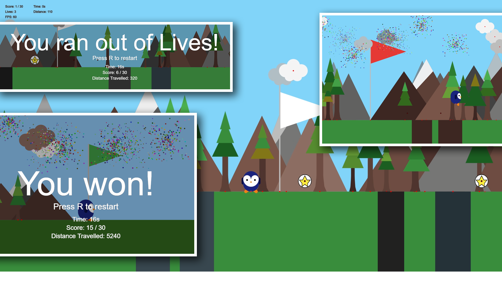

    

        
    

    

         
        <h1>CM1005 Game Project Assignment</h1>
        
Project assigned by SIM GE - UOL for the purpose of CM1005 Introduction to Computer Programming I

         
    

# Instructions
To start, open the `index.html` file using a Live Server extension.

# Configuration
To enable the display of anchor points, set the `debug_anchor` constant to `true` in the `sketch.js` file. This is set to `true` by default.

To display the frame rate counter on the top left corner of the screen, set the `debug_ui` constant to `true` in the `sketch.js` file. This is set to `true` by default.

To customize the Frame Rate, set the `applyFrameRate` constant to the desired value in the `sketch.js` file. This is set to `true` by default.

# Built Using

# Features
- [x] Player Movement
- [x] Canyon Obstacles
- [x] Collectables Score 
- [x] Sidescrolling
- [x] Player Lifes
- [x] UI Score and Life Display
- [x] Lose Condition
- [x] Animations
- [x] Sound Effects (Enhancement)
- [ ] Platforms (Enhancement)
- [ ] Particle Effects (Fireworks) (Enhancement)
- [ ] Enemies (Enhancement)

# Screenshots

# Acknowledgements
- p5.js library from [p5.js](https://p5js.org/)
- Sound Effects from [Mixkit](https://mixkit.co/)